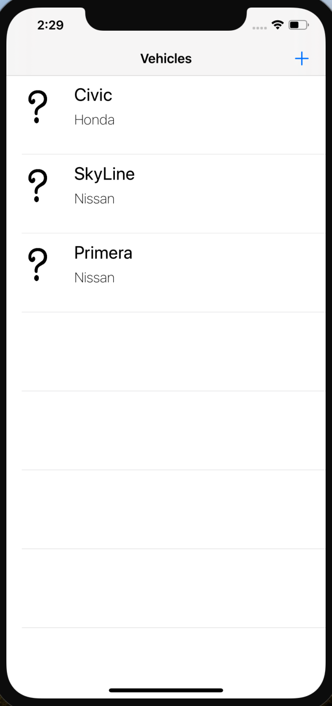
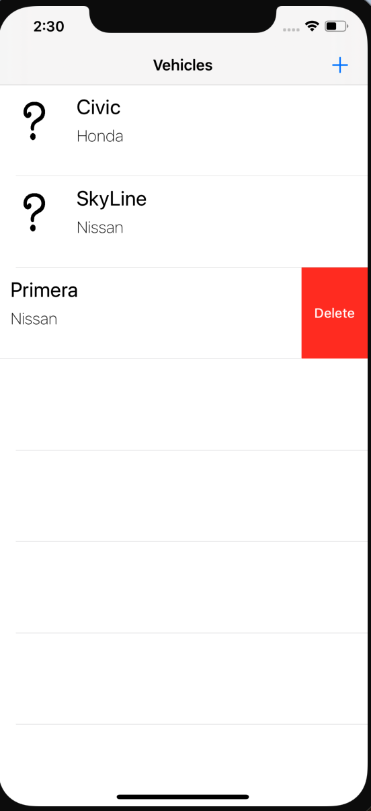
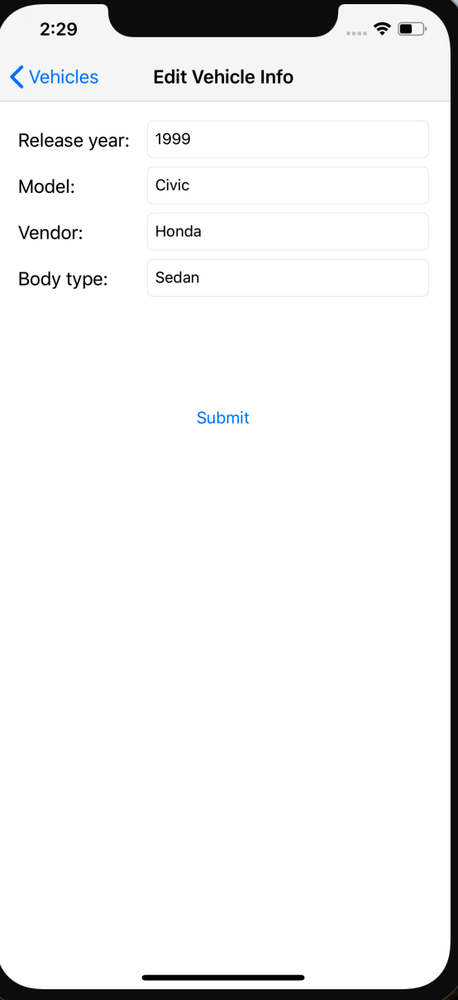
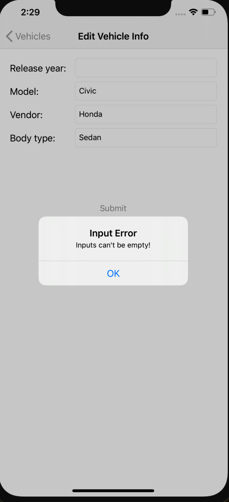
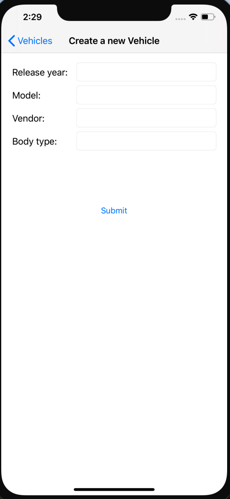

# cft-focus-start-iOS

## Таблица с автомобилями (стартовый экран)

На данном экране при первом запуске приложения у пользователя есть 3 предустановленных автомобиля
Пользователь может:

* Изменить имеющиеся автомобили(по тапу откроется окно редактирования информации)
* Добавить новый автомобиль(нажать на кнопку "+")
* Удалить автомобиль через правый свайп

## Экран изменения информации по автомобилю(открывается по тапу)

При изменении информации нельзя оставлять пустые поля.
Если такое произойдет, то на экране появится алерт, который на это укажет

## Экран создания нового автомобиля(появляется при нажатии кнопки "+" на главном экране)

Поведение совпадает с экраном изменения данных - все поля должны быть заполнены для создания новой записи в таблице
Если пользователь передумал создавать новую машину, то следует нажать кнопку назад

